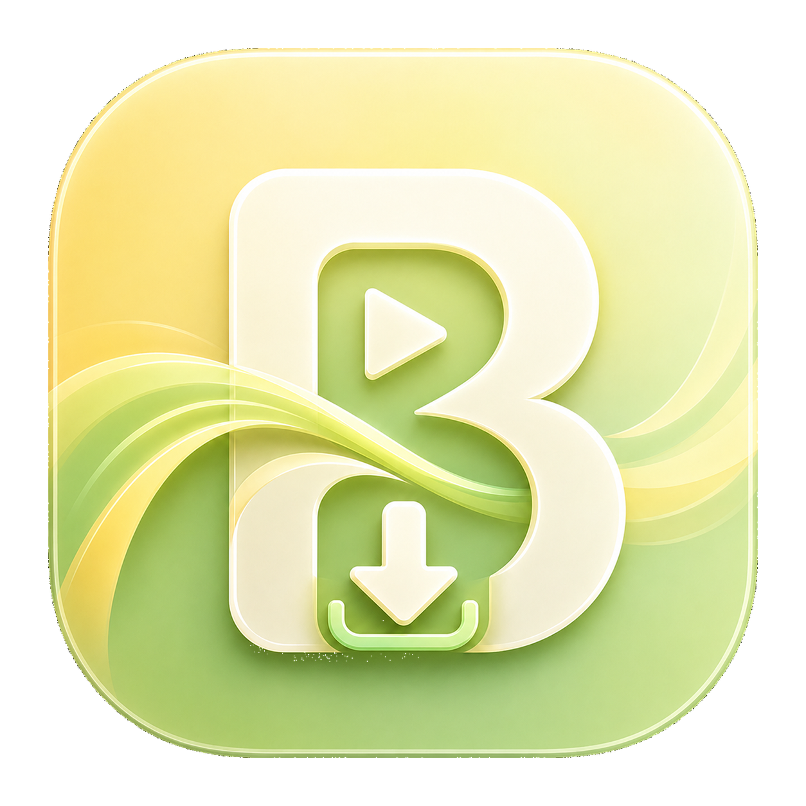
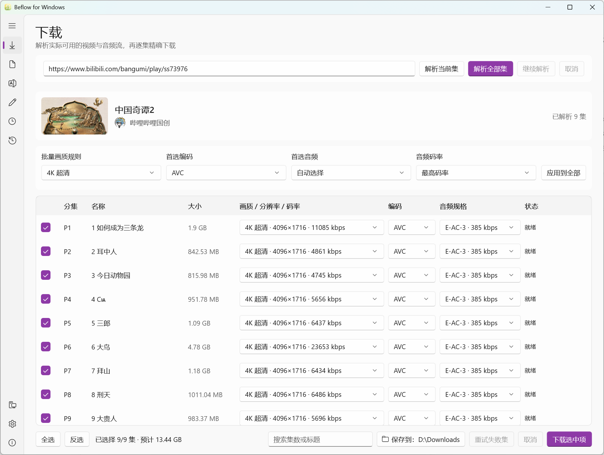

# Beflow for Windows

<p align="center">
  
</p>

**A Simple Desktop Video Downloader**

**基于 BBDown 构建的桌面视频下载器图形界面**

`Beflow for Windows` 使用 WinUI 3 与 .NET 10 构建，通过 [BBDown](https://github.com/nilaoda/BBDown) 完成 Bilibili 视频解析和下载。本项目是独立的第三方图形界面，不隶属于 BBDown 或哔哩哔哩。



## 功能

- 普通视频、多分P、番剧及整季下载
- 杜比视界、HDR、4K 至 360P，AVC、HEVC 和 AV1
- E-AC-3、M4A、FLAC、AC-3、DTS 音频选择与自动回退
- WEB/TV 扫码登录及独立账号状态
- CDN、多线程、aria2c、字幕、弹幕和封面
- 双链接或奇偶分P双音轨下载、延迟与 MKV 批量封装
- 下载后直接进入原生影视重命名，支持 TMDB、独立命名模板管理、媒体规格识别、字幕/弹幕/封面联动及安全撤销
- 下载历史、增量日志、持久日志和任务取消
- 跟随系统、浅色与深色主题切换，并记忆上次选择
- 安装版与便携版在线更新

运行时不需要 Python、Node、Eel、Vue、WebView 或预先安装的 .NET Runtime。

## 下载与安装

从 [GitHub Releases](https://github.com/Townley9288/Beflow-for-Windows/releases) 下载：

- `Beflow-for-Windows-vX.Y.Z[.R]-win-x64-setup.exe`：安装版
- `Beflow-for-Windows-vX.Y.Z[.R]-win-x64-portable.zip`：绿色便携版

项目暂未购买代码签名证书，Windows SmartScreen 可能在首次运行时显示“未知发布者”。请只从本仓库 Release 下载，并可使用同名 `.sha256` 文件核对完整性。

便携版请完整解压后运行 `Beflow.exe`，不要删除 `portable.flag`。便携数据保存在程序旁的 `Data` 目录；安装版数据保存在 `%LOCALAPPDATA%\Beflow`。

## 在线更新

软件默认在启动时每天最多检查一次 GitHub 稳定版，不会自动下载安装。关于页可以手动检查并确认更新：

- 安装版下载并校验新安装包，然后执行覆盖安装。
- 便携版由独立更新助手替换程序文件，始终保留 `Data` 和 `portable.flag`，失败时自动回滚。

更新检查直接读取 GitHub Releases 的最新稳定标签，不调用 GitHub API；五分钟内重复检查使用本地内存缓存。该功能可以在设置页关闭，GitHub 暂时不可访问不会影响下载、登录和封装功能。

## 隐私与账号数据

Beflow 不上传配置、下载历史、重命名历史、任务日志或 B 站登录数据。`BBDown.data`、`BBDownTV.data` 和用户自行配置的 TMDB API Key 只保存在本地数据目录，并已从 Git 排除；TMDB Key 不会写入日志和历史。请不要在 Issue、日志截图或错误报告中公开这些文件的内容。

## 开发

要求 Windows 10/11 x64、Visual Studio 2022 和 .NET SDK 10.0.204。

```powershell
dotnet restore BBDown-for-Windows.sln --locked-mode
dotnet test BBDown-for-Windows.sln -c Release -p:Platform=x64
dotnet build src\BBDownForWindows.App\BBDownForWindows.App.csproj -c Release -p:Platform=x64
```

生成发行包：

```powershell
.\scripts\Build-Release.ps1 -Version 1.0.5.0
```

正式 CI 使用 Native AOT 构建便携更新助手。本地 Native AOT 构建需要 Visual Studio 的 Desktop development with C++ 与 Windows 10/11 SDK；缺少时脚本会为本地测试回退到自包含单文件助手。

BBDown 与 aria2 由脚本从官方 Release 下载。固定 FFmpeg 历史归档可通过 `-FfmpegArchiveUrl`、环境变量 `FFMPEG_ARCHIVE_URL` 或本地归档提供，所有工具下载均校验 SHA-256。

## 许可证

Beflow 源码使用 [MIT License](LICENSE)。发行包聚合的独立命令行工具保留各自许可证；详情见 [第三方许可](THIRD_PARTY_NOTICES.md) 与 [第三方源码](THIRD_PARTY_SOURCES.md)。
