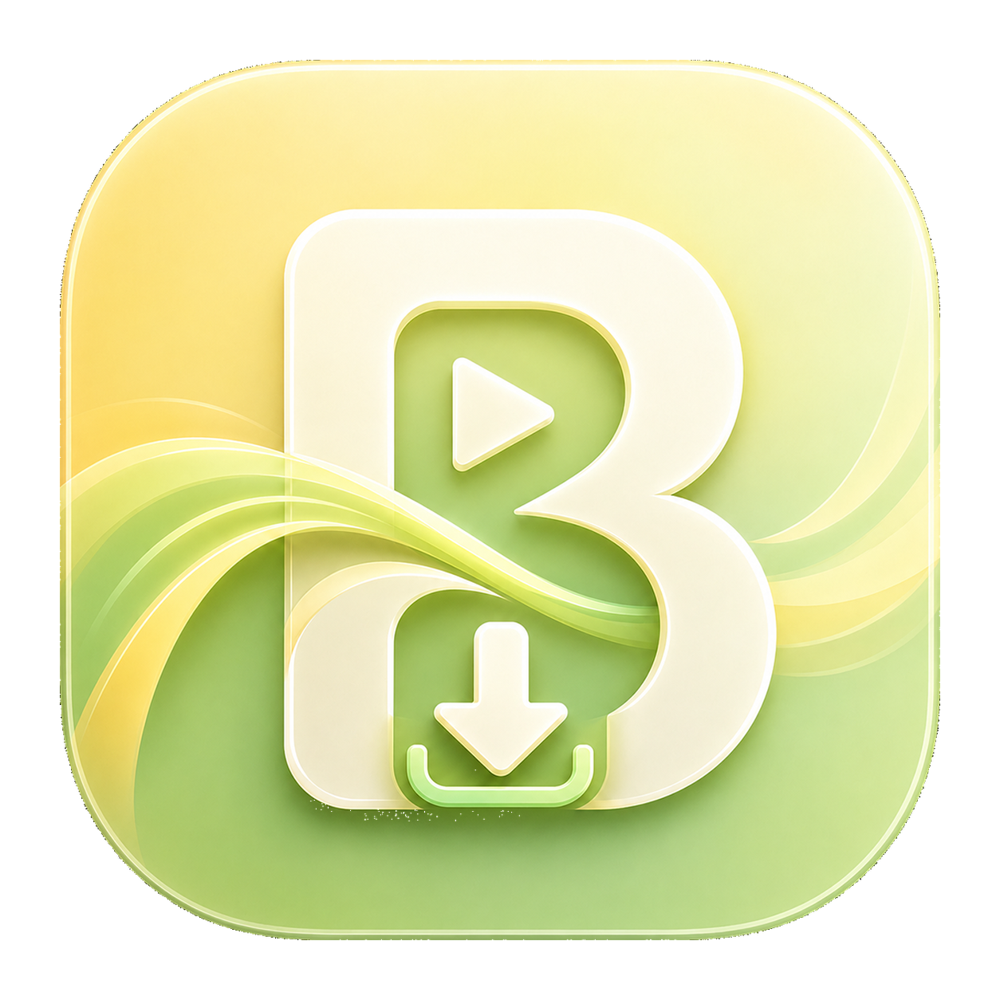
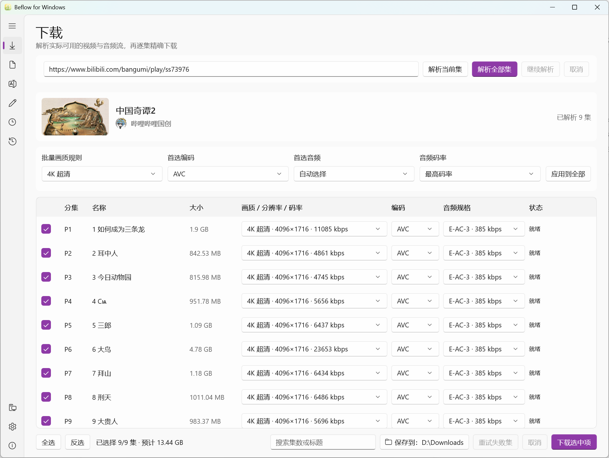

# Beflow for Windows

<p align="center">
  
</p>

**A Simple Desktop Video Downloader**

**基于 BBDown 构建的桌面视频下载器图形界面**

`Beflow for Windows` 使用 WinUI 3 与 .NET 10 构建，通过 [BBDown](https://github.com/nilaoda/BBDown) 完成 Bilibili 视频解析和下载。本项目是独立的第三方图形界面，不隶属于 BBDown 或哔哩哔哩。



## 功能

- 先解析全部分集、逐集选流后下载，支持多分P、番剧及整季增量解析
- 每集独立选择画质、真实分辨率、码率、编码与音频规格，支持批量规则和自动回退
- 杜比视界、HDR、4K 至 360P，AVC、HEVC 和 AV1
- E-AC-3、M4A、FLAC、AC-3、DTS 音频选择与自动回退
- WEB/TV 扫码登录及独立账号状态
- CDN、多线程、aria2c 自动调优、字幕、弹幕和封面
- 双链接或奇偶分P双音轨解析，支持双方独立选流、智能推荐主视频、逐集调整与 MKV 批量封装
- 下载后直接进入原生影视重命名，支持 TMDB、独立命名模板管理、媒体规格识别、字幕/弹幕/封面联动及安全撤销
- 批量下载进度、规格历史详情、失败集重试、持久日志和任务取消
- 普通下载与多音轨共用持久队列，支持等待任务编辑、排序和暂停续传
- 跟随系统、浅色与深色主题切换，并记忆上次选择
- 剪贴板链接自动识别与解析、下载及多音轨页面链接拖放，并提供独立开关
- 安装版在线更新

运行时不需要 Python、Node、Eel、Vue、WebView 或预先安装的 .NET Runtime。

## 下载与安装

从 [GitHub Releases](https://github.com/Townley9288/Beflow-for-Windows/releases) 下载 `Beflow-for-Windows-vX.Y.Z[.R]-win-x64-setup.exe` 安装版。项目不再发布便携版。

项目暂未购买代码签名证书，Windows SmartScreen 可能在首次运行时显示“未知发布者”。请只从本仓库 Release 下载，并可使用同名 `.sha256` 文件核对完整性。

安装版数据保存在 `%LOCALAPPDATA%\Beflow`，覆盖安装会保留现有配置和历史记录。

开启剪贴板监听后，在其他应用复制 B 站链接会自动填入并解析。当前位于多音轨封装页时，链接依次填入空的来源 A、B；解析期间复制的新链接会等待当前解析结束。两框都有链接时会询问替换哪个来源，重复链接不会覆盖另一来源。“同一链接奇偶分P”模式使用来源 A 输入框。

## 下载队列

队列页按“等待中”“进行中”“已完成”“失败 / 已取消”分栏显示任务和数量。尚未开始及正在编辑的任务放在“等待中”；已开始、正在停止或已暂停的任务放在“进行中”；部分失败也归入“失败 / 已取消”。

解析并选择分集及音视频规格后，点击“加入队列”。普通下载和多音轨任务按加入顺序执行，下载时可以继续解析其他链接。尚未开始的任务可以编辑、上移或下移。

“暂停”保留当前任务的断点；“取消当前任务”结束该任务并继续下一个。关闭软件会保存队列，下次打开后需手动点击“继续”。内置单线程、多线程和 aria2 均支持断点续传，资源或断点校验不通过时会显示错误并保留文件。

内置传输完成并保存校验信息后，会清理该轨道的下载分片。多音轨的来源文件按“保留来源文件”设置处理；“清理完成记录”只移除队列记录，保留成品和历史记录。

## 在线更新

软件默认在启动时每天最多检查一次 GitHub 稳定版，不会自动下载安装。关于页可以手动检查并确认更新：

- 安装版下载并校验新安装包，然后执行覆盖安装。

更新检查直接读取 GitHub Releases 的最新稳定标签，不调用 GitHub API；五分钟内重复检查使用本地内存缓存。该功能可以在设置页关闭，GitHub 暂时不可访问不会影响下载、登录和封装功能。

## 隐私与账号数据

Beflow 不上传配置、下载历史、重命名历史、任务日志或 B 站登录数据。`BBDown.data`、`BBDownTV.data` 和用户自行配置的 TMDB API Key 只保存在本地数据目录，并已从 Git 排除；TMDB Key 不会写入日志和历史。请不要在 Issue、日志截图或错误报告中公开这些文件的内容。

## 开发

要求 Windows 10/11 x64、Visual Studio 2022 和 .NET SDK 10.0.204。

```powershell
dotnet restore BBDown-for-Windows.sln --locked-mode
dotnet test BBDown-for-Windows.sln -c Release -p:Platform=x64
dotnet build src\BBDownForWindows.App\BBDownForWindows.App.csproj -c Release -p:Platform=x64
```

队列续传与完成后清理的本地 HTTP 验证：

```powershell
.\scripts\AcquireTools.ps1 -OutputDirectory artifacts/queue-validation/tools-build
dotnet build tests/QueueTransferHarness/QueueTransferHarness.csproj -c Release
python scripts/Test-QueueTransfers.py
```

每次运行会创建独立结果目录。真实 B 站队列与跨进程恢复验证见 `tests/QueueIntegrationHarness/README.md`。

生成发行包：

```powershell
.\scripts\Build-Release.ps1 -Version 1.1.1.11
```

BBDown 与 aria2 由脚本从官方 Release 下载。固定 FFmpeg 历史归档可通过 `-FfmpegArchiveUrl`、环境变量 `FFMPEG_ARCHIVE_URL` 或本地归档提供，所有工具下载均校验 SHA-256。

## 许可证

Beflow 源码使用 [MIT License](LICENSE)。发行包聚合的独立命令行工具保留各自许可证；详情见 [第三方许可](THIRD_PARTY_NOTICES.md) 与 [第三方源码](THIRD_PARTY_SOURCES.md)。
